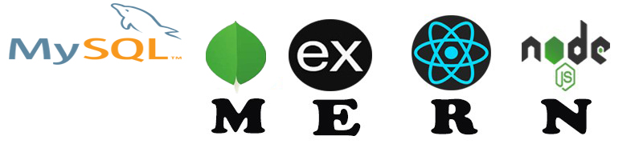

# 💫 About Me:
Hey👋,  I'm a Full-stack Web Developer

## 🌐 Socials:
 

# 💻 Tech Stack:
                               
# 📊 GitHub Stats:
 
 

<!-- Proudly created with GPRM ( https://gprm.itsvg.in ) -->